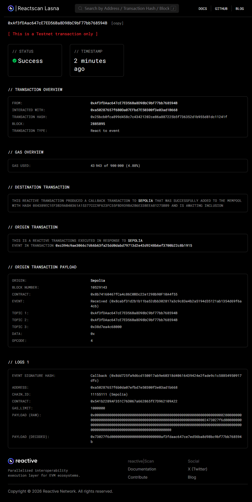
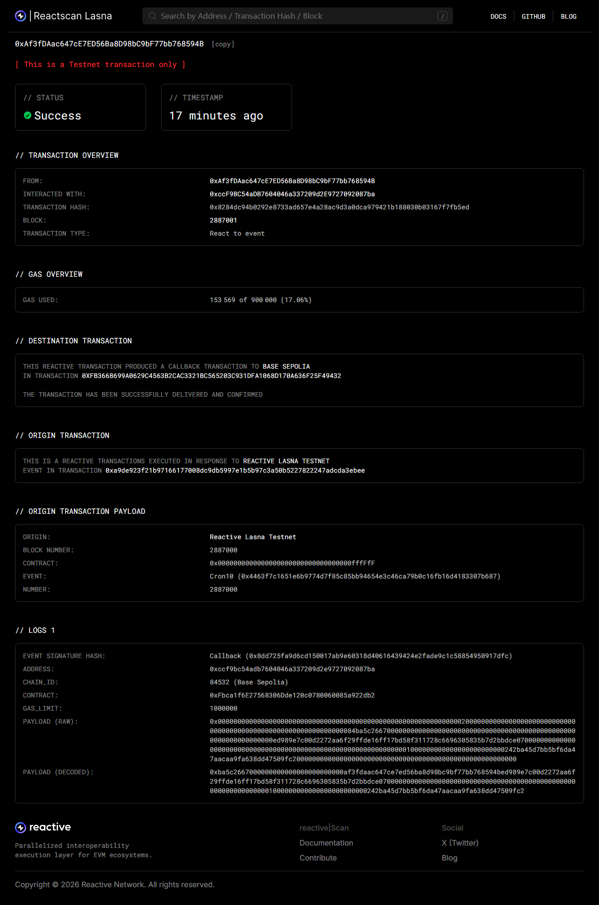
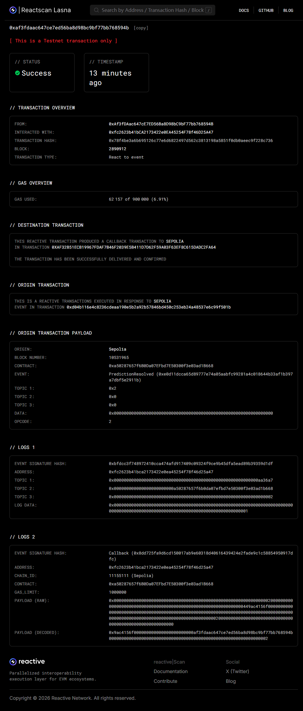
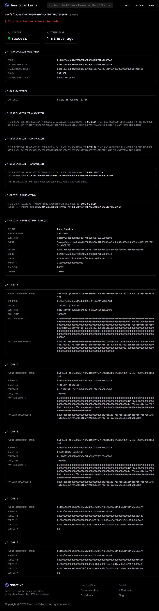

# Reactive Demo Workflow Proof

## Submission

Demo 1: basic / [origin tx](https://sepolia.etherscan.io/tx/0xc394c9ae3066c7d66b63fa25dd0dabd79713d2e43d9248b6ef3700b22c8b1915) / [reactive tx](https://lasna.reactscan.net/address/0xAf3fDAac647cE7ED56Ba8D98bC9bF77bb768594B/18) / [destination tx](https://sepolia.etherscan.io/tx/0x4389ec1ef3b39ab40361a15377ccc9f623fc55fbd939ba2b6e33beea81275bb9)

Demo 2: cron / [origin tx](https://sepolia.basescan.org/tx/0xed989e7c00d2272aa6f29ffde16ff17bd58f311728c6696305835b7d2bbdce07) / [reactive tx](https://lasna.reactscan.net/address/0xAf3fDAac647cE7ED56Ba8D98bC9bF77bb768594B/21) / [destination tx](https://sepolia.basescan.org/tx/0xfb366b699a0629c4563b2cac3321bc565203c931dfa1068d170a636f25f49432)

Demo 3: automated-prediction-market / [origin tx](https://sepolia.etherscan.io/tx/0xd04b116e4c8236cdeaa190e5b2a92b57846bd450c253eb24a48537e6c99f501b) / [reactive tx](https://lasna.reactscan.net/address/0xAf3fDAac647cE7ED56Ba8D98bC9bF77bb768594B/24) / [destination tx](https://sepolia.etherscan.io/tx/0xaf32b51ecb19967fdaf7b46f2039e5b411d7d62f59a03f63ef8c615dadc2fa64)

Demo 4: gasless-cross-chain-atomic-swap / [origin tx](https://sepolia.etherscan.io/tx/0x70fa5807085e5946b7410d7a0e9e88e3768194aec63a2e73b1dc37df19b1c141) / [reactive tx](https://lasna.reactscan.net/address/0xAf3fDAac647cE7ED56Ba8D98bC9bF77bb768594B/37) / [destination tx](https://sepolia.basescan.org/tx/0xcf3f6331049a89aa5ddbe77f1d1d961bb4c0d059361ee5586246c84840737998)

## Demo 1 Details

- Demo name: `basic`
- Origin network: `Ethereum Sepolia`
- Destination network: `Ethereum Sepolia`
- Reactive network: `Reactive Lasna Testnet`
- Origin contract: `0x8b74160467fCa4c86C0BDc22e1298b90F10A4f55`
- Origin deploy tx: [0xe255b842925d2eec362436e46560a98baf880abfbf14826f0b52a904e3c529ae](https://sepolia.etherscan.io/tx/0xe255b842925d2eec362436e46560a98baf880abfbf14826f0b52a904e3c529ae)
- Destination contract: `0x541b2289AF351C76D067a662865fE7D962109A22`
- Destination deploy tx: [0xe2da7172442748fc57a4e5a6e77d5ecfc098c1e1af4d881545361aae01f8c469](https://sepolia.etherscan.io/tx/0xe2da7172442748fc57a4e5a6e77d5ecfc098c1e1af4d881545361aae01f8c469)
- Reactive contract: `0xa50287657f6B0Da07EFbd7E50300f3e03ad1B668`
- Reactive deploy tx: [0x2fe019328e10de1d1b6a4fc6f12729b274d0cc4cba6b611ac7e95508a1eafb65](https://lasna.reactscan.net/tx/0x2fe019328e10de1d1b6a4fc6f12729b274d0cc4cba6b611ac7e95508a1eafb65)
- Origin transaction: [0xc394c9ae3066c7d66b63fa25dd0dabd79713d2e43d9248b6ef3700b22c8b1915](https://sepolia.etherscan.io/tx/0xc394c9ae3066c7d66b63fa25dd0dabd79713d2e43d9248b6ef3700b22c8b1915)
- Reactive transaction hash: `0x25bcb0fca899d458c7c43421202ce86a887225b5f736352d1b955d81dc11241f`
- Reactive transaction proof page: [Reactscan detail](https://lasna.reactscan.net/address/0xAf3fDAac647cE7ED56Ba8D98bC9bF77bb768594B/18)
- Destination transaction: [0x4389ec1ef3b39ab40361a15377ccc9f623fc55fbd939ba2b6e33beea81275bb9](https://sepolia.etherscan.io/tx/0x4389ec1ef3b39ab40361a15377ccc9f623fc55fbd939ba2b6e33beea81275bb9)

## Screenshot Evidence

The screenshot below is the Reactscan detail page for the reactive transaction. It shows the reactive transaction hash and the linked origin and destination transaction hashes in the same view.

## Demo 2 Details

- Demo name: `cron`
- Origin network: `Base Sepolia`
- Destination network: `Base Sepolia`
- Reactive network: `Reactive Lasna Testnet`
- Origin contract: `0xECD83C800037e10cEF0072a196e00d13bB3041fB`
- Origin deploy tx: [0xea4a97e477aa6d97e560e3fef7340bed929937f8d87eb8dfeab854ed5a289a08](https://sepolia.basescan.org/tx/0xea4a97e477aa6d97e560e3fef7340bed929937f8d87eb8dfeab854ed5a289a08)
- Destination contract: `0xFbca1f6E27568306Dde120c0780060085a922db2`
- Destination deploy tx: [0x749c876b38c47280e14dc62596308512b24001423b23762a7129797ccb13f4ab](https://sepolia.basescan.org/tx/0x749c876b38c47280e14dc62596308512b24001423b23762a7129797ccb13f4ab)
- Reactive contract: `0xccF9BC54aDB7604046a337209d2E9727092087ba`
- Reactive deploy tx: [0xda2c4dbc861b2ce834991e966693b66bc6bdd989fba8b6aca195b0b61c0c191a](https://lasna.reactscan.net/tx/0xda2c4dbc861b2ce834991e966693b66bc6bdd989fba8b6aca195b0b61c0c191a)
- Origin arm transaction: [0xed989e7c00d2272aa6f29ffde16ff17bd58f311728c6696305835b7d2bbdce07](https://sepolia.basescan.org/tx/0xed989e7c00d2272aa6f29ffde16ff17bd58f311728c6696305835b7d2bbdce07)
- Reactive ingress transaction hash: `0x12e54026df5db0862a5e523b7e132eb8983dff1326b9adef10194eeee19ca9d5`
- Reactive callback transaction hash: `0x8284dc94b0292e8733ad657e4a28ac9d3a0dca979421b188030b03167f7fb5ed`
- Reactive transaction proof page: [Reactscan detail](https://lasna.reactscan.net/address/0xAf3fDAac647cE7ED56Ba8D98bC9bF77bb768594B/21)
- Destination transaction: [0xfb366b699a0629c4563b2cac3321bc565203c931dfa1068d170a636f25f49432](https://sepolia.basescan.org/tx/0xfb366b699a0629c4563b2cac3321bc565203c931dfa1068d170a636f25f49432)

Notes:

- `demo2` is a cron-driven workflow, so Lasna shows one intermediate ingress transaction first, then a separate reactive callback transaction on the next `Cron10` trigger.
- The submission line above uses the final callback-producing reactive transaction as the `reactive tx`.
- The destination contract state was confirmed on-chain with `callbackCount = 1`, `lastOriginTxHash = 0xed989e7c00d2272aa6f29ffde16ff17bd58f311728c6696305835b7d2bbdce07`, and `lastArmNonce = 1`.

## Demo 2 Screenshot Evidence

The screenshot below is the Reactscan detail page for the callback-producing reactive transaction. It shows the reactive transaction hash and the linked destination callback transaction in the same view.

## Demo 3 Details

- Demo name: `automated-prediction-market`
- Origin network: `Ethereum Sepolia`
- Destination network: `Ethereum Sepolia`
- Reactive network: `Reactive Lasna Testnet`
- Origin contract: `0xa50287657f6B0Da07EFbd7E50300f3e03ad1B668`
- Origin deploy tx: [0x15ec939d7abd079fa6ad25b5018b1938475d4b72d6a884ef7d9a66669b0377af](https://sepolia.etherscan.io/tx/0x15ec939d7abd079fa6ad25b5018b1938475d4b72d6a884ef7d9a66669b0377af)
- Destination contract: `0xa50287657f6B0Da07EFbd7E50300f3e03ad1B668`
- Destination deploy tx: [0x15ec939d7abd079fa6ad25b5018b1938475d4b72d6a884ef7d9a66669b0377af](https://sepolia.etherscan.io/tx/0x15ec939d7abd079fa6ad25b5018b1938475d4b72d6a884ef7d9a66669b0377af)
- Reactive contract: `0xfc2623b41bCA2173422e0EA45254F78f46D25A47`
- Reactive deploy tx: [0xe40b042931a8024ec97cc8a006effcb7aedf7524d7bfbf14dd0c07ec58146250](https://lasna.reactscan.net/tx/0xe40b042931a8024ec97cc8a006effcb7aedf7524d7bfbf14dd0c07ec58146250)
- Origin transaction: [0xd04b116e4c8236cdeaa190e5b2a92b57846bd450c253eb24a48537e6c99f501b](https://sepolia.etherscan.io/tx/0xd04b116e4c8236cdeaa190e5b2a92b57846bd450c253eb24a48537e6c99f501b)
- Reactive transaction hash: `0x78f4be3a6b695126c77e6d6822497d562c3813198a5851f0db0aeec9f228c736`
- Reactive transaction proof page: [Reactscan detail](https://lasna.reactscan.net/address/0xAf3fDAac647cE7ED56Ba8D98bC9bF77bb768594B/24)
- Destination transaction: [0xaf32b51ecb19967fdaf7b46f2039e5b411d7d62f59a03f63ef8c615dadc2fa64](https://sepolia.etherscan.io/tx/0xaf32b51ecb19967fdaf7b46f2039e5b411d7d62f59a03f63ef8c615dadc2fa64)

Notes:

- This workflow uses the same Sepolia contract as both the origin and destination contract.
- The origin transaction resolved prediction `2`, the Reactive transaction observed that resolution event on Lasna, and the destination transaction executed the Sepolia callback that distributed winnings.

## Demo 3 Screenshot Evidence

The screenshot below is the Reactscan detail page for the callback-producing reactive transaction. It shows the reactive transaction hash and the linked origin and destination transaction hashes in the same view.

## Demo 4 Details

- Demo name: `gasless-cross-chain-atomic-swap`
- Origin network: `Ethereum Sepolia`
- Destination network: `Base Sepolia`
- Reactive network: `Reactive Lasna Testnet`
- Origin token: `0xee219544f945f7AbDAb763C8afE3708119eE5A7b`
- Origin token deploy tx: [0x851d587b6e1a412b93650c2ddbde24320fd67ae84099c53b8a8bfdbc77268887](https://sepolia.etherscan.io/tx/0x851d587b6e1a412b93650c2ddbde24320fd67ae84099c53b8a8bfdbc77268887)
- Origin contract: `0xc359f9Af1cBd2Dcb84F0B48F92E9C130a50A54B6`
- Origin deploy tx: [0x4bda1c8799a3e968afd8506c337d5515140796fcf7a5bcdf33596a2dcacd7158](https://sepolia.etherscan.io/tx/0x4bda1c8799a3e968afd8506c337d5515140796fcf7a5bcdf33596a2dcacd7158)
- Destination token: `0x970D2B1C2d53C9bDccCf1c585CD8ddb61131D170`
- Destination token deploy tx: [0xf7c542c6632604a989a5b32210db14a391726fd0541237361daba72856828dc6](https://sepolia.basescan.org/tx/0xf7c542c6632604a989a5b32210db14a391726fd0541237361daba72856828dc6)
- Destination contract: `0xd8D7B3a6D80FBeEFa84f4ba868D57532E0d00E0B`
- Destination deploy tx: [0x613cd4d412365e2d3687ec87b9f1f4b31f33f202339af2b5b4851046f63a9a5e](https://sepolia.basescan.org/tx/0x613cd4d412365e2d3687ec87b9f1f4b31f33f202339af2b5b4851046f63a9a5e)
- Reactive contract: `0x3fAf3459C5BC611c4C8023eb61d25719A753a184`
- Reactive deploy tx: [0x89a59c03d9988af4bb52e0b8fa020a46ce35ea0940f0ca9b403b2728a15c850c](https://lasna.reactscan.net/tx/0x89a59c03d9988af4bb52e0b8fa020a46ce35ea0940f0ca9b403b2728a15c850c)
- Origin transaction: [0x70fa5807085e5946b7410d7a0e9e88e3768194aec63a2e73b1dc37df19b1c141](https://sepolia.etherscan.io/tx/0x70fa5807085e5946b7410d7a0e9e88e3768194aec63a2e73b1dc37df19b1c141)
- Reactive transaction hash: `0xcb5b2ee2b8f23292dce88f33d60cc79a1f76eb953985c0030900385bb40ad68c`
- Reactive transaction proof page: [Reactscan detail](https://lasna.reactscan.net/address/0xAf3fDAac647cE7ED56Ba8D98bC9bF77bb768594B/37)
- Destination transaction: [0xcf3f6331049a89aa5ddbe77f1d1d961bb4c0d059361ee5586246c84840737998](https://sepolia.basescan.org/tx/0xcf3f6331049a89aa5ddbe77f1d1d961bb4c0d059361ee5586246c84840737998)

Notes:

- This rerun used the Sepolia callback proxy `0xc9f36411C9897e7F959D99ffca2a0Ba7ee0D7bDA` and the Base Sepolia callback proxy `0xa6eA49Ed671B8a4dfCDd34E36b7a75Ac79B8A5a6` from the current Reactive docs.
- The final Reactive transaction (`/37`) was triggered by the destination-chain `depositTokens()` transaction [0x6de9f9b5badc3e621712ae47b7436c389591eeb7baacf3609ceaa1273caa89cc](https://sepolia.basescan.org/tx/0x6de9f9b5badc3e621712ae47b7436c389591eeb7baacf3609ceaa1273caa89cc).
- This rerun uses the officially supported target testnet `Base Sepolia (84532)`, so Reactscan directly labels the callback `chain_id` as `Base Sepolia` instead of `Unknown Network`.
- Final balances confirmed the swap outcome:
  User1 (`0x242BA45D7bB5Bf6DA47AAcAa9fA638dD47509fc2`) received `25 CTK2` on Base Sepolia,
  and User2 (`0xAf3fDAac647cE7ED56Ba8D98bC9bF77bb768594B`) received `50 ITK2` on Ethereum Sepolia.

## Demo 4 Screenshot Evidence

The screenshot below is the Reactscan detail page for the final callback-producing Reactive transaction. It shows the reactive transaction hash, the originating Base Sepolia deposit transaction, and the callback data with `chain_id 84532` labeled as `Base Sepolia`.

